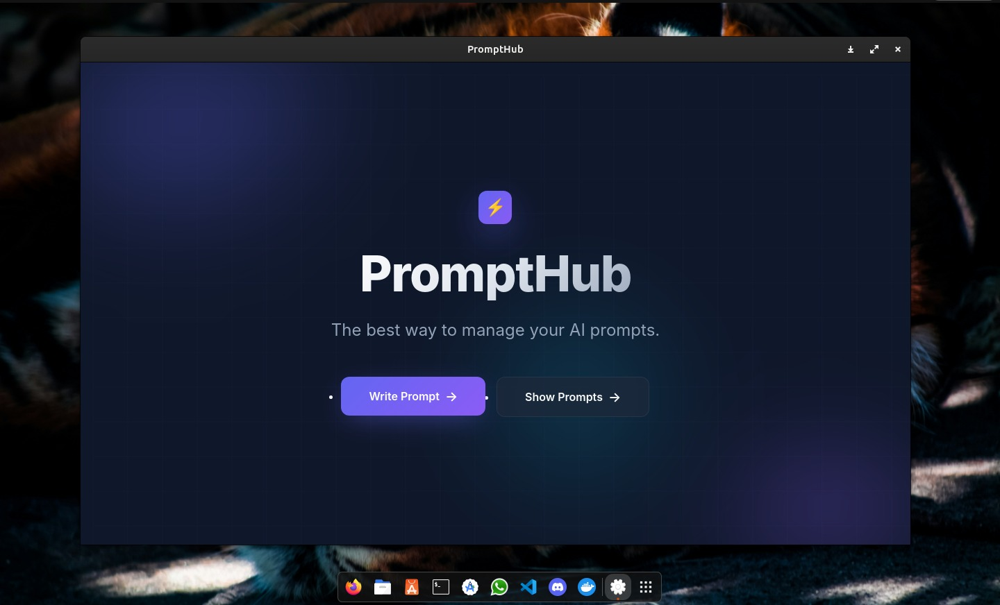

<div align="center">

# 🚀 PromptHub

**"You don't need a complex product. You need a clear purpose."**

A minimal, fast, and focused desktop application for managing AI prompts.
<br>
No cloud dependencies. No subscriptions. Just your prompts, organized.

[View Demo](#-preview) • [Key Features](#-features) • [Installation](#-quick-start)

</div>

---

## 📸 Preview



> *The PromptHub interface: clean, focused, and ready to capture your best AI prompts.*

---

## 🤔 Why PromptHub?

Every AI power user faces the same friction: great prompts get lost in notes apps, chat histories, or scattered text files. 

**PromptHub solves one problem perfectly:** It gives you a dedicated, local space to store, categorize, and retrieve your best AI prompts.

| 🚫 The Problem | ✅ PromptHub's Solution |
| :--- | :--- |
| Prompts buried in Notion/Evernote | **Dedicated prompt-first interface** |
| Cloud services with privacy concerns | **100% local SQLite database** |
| Bloated apps with learning curves | **Open, write, save, find—in 10 seconds** |
| Subscription fatigue | **Free, open-source, yours forever** |

---

## ✨ Features

* **⚡ Instant Capture:** Write and save prompts with zero friction.
* **🏷️ Smart Tagging:** Mark favorites and categorize as System or User prompts.
* **🔍 Fast Search:** Find prompts by title or content instantly.
* **📋 One-Click Copy:** Copy prompt body to clipboard immediately.
* **🖥️ Native Experience:** PyWebView wrapper provides a real app window, not a browser tab.
* **💾 Truly Local:** All data lives in a single `prompthub.db` file on your machine.

---

## 🛠️ Tech Stack

| Layer | Technology |
| :--- | :--- |
| **Backend** | FastAPI (Python) |
| **Frontend** | Vanilla HTML/CSS/JS + Tailwind CSS |
| **Database** | SQLite3 |
| **Desktop Shell** | PyWebView |
| **Packaging** | PyInstaller |

---

## 🚀 Quick Start

### Prerequisites
* Python 3.8+
* pip

### Installation

1.  **Clone the repository**
    ```bash
    git clone https://github.com/cyberytti/PromptHub.git
    cd PromptHub
    ```

2.  **Set up a Virtual Environment (Recommended)**
    ```bash
    python -m venv venv
    # Windows:
    venv\Scripts\activate
    # Mac/Linux:
    source venv/bin/activate
    ```

3.  **Install dependencies**
    ```bash
    pip install -r requirements.txt
    ```

4.  **Run the App**
    ```bash
    python desktop_app.py
    ```

---

## 📦 Building for Distribution

To create a standalone `.exe` or executable file:

```bash
# Install PyInstaller
pip install pyinstaller

# Build the executable
pyinstaller --windowed \    
  --exclude-module PyQt6 \
  --add-data "index.html:." \
  --add-data "show_prompts.html:." \
  --add-data "write_prompt.html:." \
  --icon=prompthub_logo.ico \
  desktop_app.py

```

*Note: On Windows, use `;` instead of `:` for the `--add-data` separator.*

---

## 📁 Project Structure

```text
PromptHub/
├── main.py             # FastAPI server + SQLite operations
├── desktop_app.py      # PyWebView desktop wrapper
├── index.html          # Landing page
├── write_prompt.html   # Create new prompts
├── show_prompts.html   # Browse, search, manage prompts
├── prompthub.db        # Local SQLite database (auto-created)
└── README.md

```

---

## 📜 License

Distributed under the **GNU GPLv3 License**. See `LICENSE` for more information.

---

<div align="center">

**PromptHub** — Keep your best AI prompts within reach.


No onboarding. No tutorials. Just open and write. ✍️

</div>
